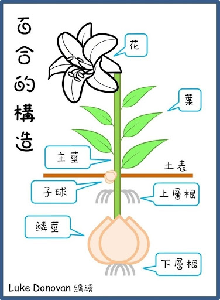
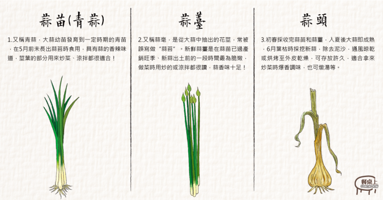
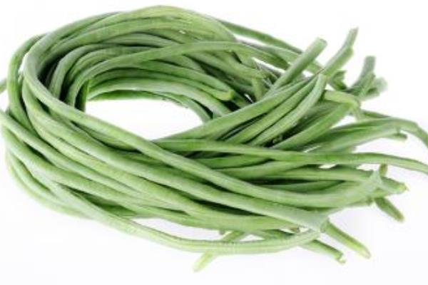

# 園藝植物分類

一般植物是從**科**開始做分類，大部分科命以屬名加 - aceae，例如：茄科 *Solanaceae*、薔薇科*Rosaceae*、石蒜科*Amaryllidaceae*、百合科LILIACEAE、木蘭科<u>magnoliaceae</u>

科名第一個字母為大寫，且有時加底線或用斜體，也可完全用大寫字母

## 三名法

屬名(名詞) + 種名(形容詞) + 亞種(變種、變型)

+ 亞種：subsp. 或 ssp.

+ 變種：var.

+ 變型：f.

### 亞種 (Subspecies)

一般認為是一個種內的族群，在形態上多少有變異，**並具有地理分佈上、生態上或季節上的隔離**

亞種的差別比變種大，亞種常用於**生態隔離**，有**獨立演化傾向**的物種。如櫻花鉤吻是台灣特有亞種

> 秈稻(在來米) *Oryza sativa* L. subsp. indica **熱帶地區**
> 
> 稉稻 (蓬萊米) *Oryza sativa* L. subsp. japonica **溫帶地區**

### 變種 (Varietas)

一個種在形態上多少有變異，變異比較穩定，它的**分佈範圍比亞種小得多**，與種內其他變種有共同的分佈區

> *Brassica oleracea* L. var. capitata (甘藍)
> 
> *Brassica oleracea* L. var. botrytis (花椰菜)
> 
> *Brassica oleracea* L. var. italica Plenca (青花菜)

---

> 國際植物命名規約 ICBN 只認**亞種**與**變種**其他一概不予承認

---

### 變型 (Forma)

> 甘藍 *Brassica oleracea* L. var. capitata L.
> 
> 紫甘藍 *Brassica oleracea* var. *capitata* f. rubra
> 
> 紫色百香果 *Passiflora edulis* f. edulist
> 
> 黃色百香果 *Passiflora edulis* f. flavicarpa

### 栽培品種 (Cultivar)

品種 cultivar = cultivated variety 只用於栽培植物的分類上，在野生植物中不使用**品種**這一名詞，栽培品種名第一個字母大寫，不加底線或用斜體

Line (實生系)：種子繁植

Clone (營養系)：無性繁殖

> *Ilex cornuta* cv. Burfordii (無刺冬青)

### Hybrid plants (雜交植物)

+ Hybrid genus (雜交屬)
  
  + *X Fatshedera*, a hybrid between the genera <u>Fatsia</u> and <u>Hedera</u>

+ Hybrid species (雜交種)
  
  + *pelargonium* X *hortorum* and *Petunia* X *hybrida*

| 縮寫                 | 原拉丁文          | 代表意義                      |
|:------------------:|:-------------:|:-------------------------:|
| **cv.**            | cultivarietas | 栽培品種(園藝種)                 |
| et                 | X et Y        | 代表 X 與 Y 一起命名此一物種         |
| et al.             | et alii       | 和其他的(人、事、物)               |
| sp                 | species       | 種                         |
| **subsp. or ssp.** | subspecies    | 亞種                        |
| **var.**           | vartietas     | 變種(同種而分佈不同地理位置，而有性狀上的差異者) |
| subvar.            | subvarietas   | 亞變種                       |
| **f.**             | forma         | 變型                        |
| nov.               | novus         | 新的                        |
| X                  | hybrid        | 雜交                        |
| +                  | graft         | 嫁接                        |

## 園藝植物分類

### 蔬菜

#### 1. 按植物器官

+ 根菜類：
  
  + 直根類：紅蘿蔔(carrot)、牛蒡(great burdock)
  
  + 塊根類：甘藷、山藥

+ 莖菜類：
  
  + 地上莖類：蘆荀 (asparagus)、竹筍 (bamboo shoot)
  
  + 地下莖類
    
    + 塊莖類：馬鈴薯
    
    + 根莖類：藕、薑
    
    + 球莖類：芋、荸薺
    
    + 鱗莖類：百合、洋蔥
    
    

+ 花菜類：
  
  + 食用花蕾：花椰菜(cauliflower)、青花菜(broccoli)
  
  + 食用花苔：韮菜薹(Chinese chive flower stalk)、大蒜薹(garlic clower stalk)
  
  + 食用花朵：金針菜(day lily)
  
  

+ 果菜類：
  
  + 莢果：豌豆(pea)、豇豆(yard long bean)、花生(peanut)、四季豆(snap bean)
  
  + 茄果：茄子(eggplant)、蕃茄(tomato)、甜椒(sweet pepper)
  
  + 瓜果：苦瓜(bitter gourd)、絲瓜(sponge gourd)、黃瓜(cucumber)
  
  

#### 2. 按栽培季節

+ 冷季蔬菜
  
  + 不耐霜
  
  + 稍耐霜
  
  + 可耐霜

+ 暖季蔬菜
  
  + 短期蔬菜：番茄、甜椒、胡瓜、甜瓜、南瓜、菜豆
  
  + 長期蔬菜：甘藷、辣椒、黃蜀葵

### 果樹

#### 1. 按果樹生長習性

+ 木本果樹
  
  + 喬木：具有明顯主幹，且在胸高以上才有分枝出現
    
    + 落葉性果樹：蘋果(薔薇科)、梨(薔薇科)、杮(柿樹科)
    
    + 常綠性果樹：柑橘(芸香科)、芒果(漆樹科)、荔枝(無患子科)
  
  + 灌木：無花果、石榴、紅刺莓
  
  + 蔓性：葡萄(葡萄科)、百香果(西番蓮科)

+ 草本果樹：香蕉(芭蕉科)、鳳梨(鳳梨科)、番木瓜(番木瓜科)

#### 2. 按地理區域

+ 溫帶落葉果樹
  
  + 小果
    
    + 漿果狀
    
    + 懸鉤子狀
    
    + 蔓性小果
  
  + 喬木
    
    + 仁果：果肉由花托發育而成
    
    + 核果：多心皮發育

+ 熱帶及亞熱帶常樹果樹類
  
  + 草本及蔓性類
  
  + 木本類
    
    + 柑橘類
    
    + 非柑橘類

## 觀賞用植物

#### 觀花、花壇植物及觀葉植物

+ 一年生草花

+ 二年生草花

+ 多年生草花

+ 球根花卉

#### 庭園植物類

+ 綠地植物及草皮類

+ 地被植物及蔓性植物類

+ 常綠性灌木及喬木類

+ 落葉性灌木類

+ 落葉性喬木類
