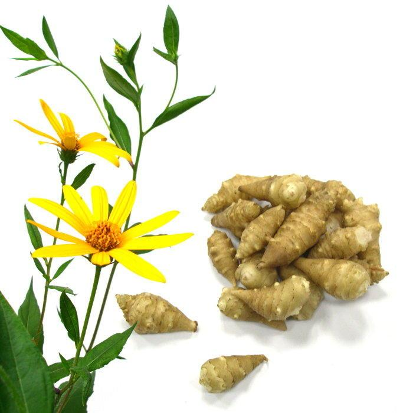
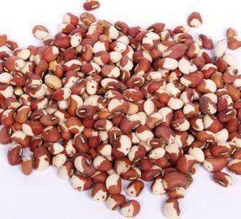
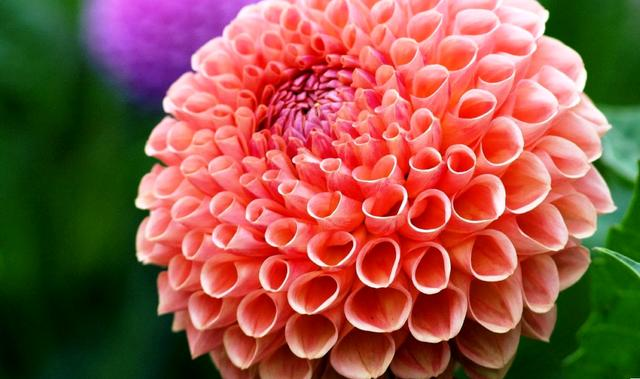
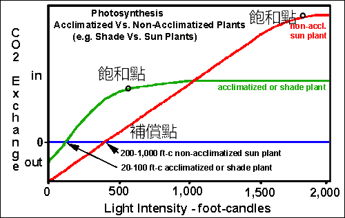

# 光與園藝作物

## 紫外光(Ultraviolet Light)

### UVA

最低能量，最沒有害的UV光，常被稱為黑暗中的光(black light)，能使螢光物質放射出可見光

### UVB

典型具有破壞性的UV光，具足夠能量破壞生物組織，而且不會完全被大氣吸收

### UVC

幾乎完全被空氣吸收

## Illuminance(照度)

+ Luminance (光度)：物體發光能力的強度稱為光度，其單位為燭光(cd)

+ Luminous flux (光通量)：每單位時間內由光源所發出或由被照體所吸收的光能，其單位為流明 (lumen)

+ Illuminance (光照度)：當物體被光照射時，每單位面積接受的光通量大小，其單位為勒克斯 (lux)

+ Photosynthetic Photon Flux Density (PPFD, 光量子通量密度)：**單位時間面積上在可見光波長範圍 (400nm~700nm) 的光量子數**。通常不能將光度單位(lux)轉換成光量子單位(PPFD)，除非光中的每種光波波長都知道
  
  > 真正對植物影響有意義的是 PPFD ，不是 lux 
  > 
  > **測量 PPFD 使用的是光量儀，而測量 lux 的則是光度計**

## 植物種植在光線上應注意的事項

+ Programmed dense planting(計畫性密植)：dense initially thinned later(初期密植、後期疏植) 
  
  > ex: 果樹類可先密集培養，到時候再分開
  > 
  > ex: 十字花科的種子很小，初期可以先大量播種，後期再把把不要的拔掉

+ 幼苗種植就需考慮植物長後的照光空間，不可以被遮閉
  
  > 有些作物種了就不能移植了所以種的時候要很注意 ex: 蘿蔔

+ Interplanting(間作): 果樹間間距過大時，中間可以再種其他作物

+ Containerized plants(盆栽植物): 容易調整植物間距

+ Hydroponical growing system(水耕): automatically adjusting spacing

## Pruning plants for light interception

+ Fruit trees
  
  + Thinning-out pruning 疏刪修剪
  
  + Open-center  training 開心整枝

+ Ornamentals
  
  + Hedge 綠籬
  
  + Espalier 樹籬
  
  + Topiary 裝飾剪
  
  + Bonsai 盆栽(常用鐡絲做固定)

## 溫室方向

北緯40度以上宜東西向，因為太陽角度較低，南北向溫室前後端會受光不均匀

北緯40度以下宜南北向，因為太陽角度較高

連棟宜南北向(東西向梁柱永遠擋到同個地方)

## 避光的作用

+ Etiolation(白化): Plants often become etionlated in response to a blanching

+ Symptons
  
  + White to yellowish stems and leaves
  
  + Spindly growth of stems
  
  + Extreme elongation of internodes
  
  + Formation of seeding hooks

## Cryptochromes & Phototropins

**cryptochromes 隱色素** 負責接收藍光

> + stem elogation
> 
> + cotyledon & leaf expansion

**phototropins 趨光素** 負責接收藍光

> phototropism(向光性)

**phytochrome 光敏素** 負責吸收紅光到遠紅光的光譜(分為Pr, Pfr)

> 分為活化型 Pfr 及 鈍化型 Pr
> 
> Pfr 接收遠紅光 Pr接收紅光
> 
> 在黑暗中，大部分的光敏素會以Pr的型態存在，照射日光之後Pr轉換成Pfr，<u>Pfr型態的光敏素能激發許多植物對光的發育反應</u>，是植物偵測陽光的方法之一。

## Photoreversibility (光可逆性)

植物合成Pr、吸收紅光後變 Pfr，Pfr 具有生物活性，在黑暗中會變回 Pr

## 光敏素對色素影響

> Pfr 可促進 Anthocyanin(花青素) 形成，比如茄子、桃子
> 
> 不照光時 Pr 較多，Pr 會造成節間生長(莖長得細長)，照光後 Pfr 較多，Pfr 會使莖長得較粗短

## 開花的光週期控制

> 菊花是短日照植物，透過夜間照光使其不會開花，若在下午晚些時候和在清晨將黑布拉到作物上則能使他開花

### Short-day plants

晚夏或秋天開花的植物，如：(cocklebur)倉耳、(poinsettia)一品紅、菊花(chrysanthemum)

### Long-day plants

夏天開花植物，如：報春花(Evening primorse)、波菜(spinach)

## 日長影響儲藏器官

+ <u>短日</u>刺激儲藏器官生長
  
  > 馬鈴薯、菊芋、紅花菜豆
  > 
  > 菊芋↓
  > 
  > 
  > 
  > 紅花菜豆↓
  > 
  > 

+ <u>長日</u>刺激儲藏器官生長
  
  > 洋蔥、大蒜

+ 長日短日不影響
  
  > 大麗花
  > 

+ 短日有利於塊根肥大

+ 草莓：長日下走莖伸長，有利於繁殖與結果

+ 吊藍：短日刺激走莖伸長

+ 落地生根：長日刺激葉緣的小植物生長

## 陽性植物與陰性植物之光合作用與光強度之關係

**陽性植物光補償點較高**，光線增加時，二氧化碳消耗速度顯注地增加，**光飽和點也較高**；反之，**陰性植物的光補償點較低**，光線增加時，二氧化碳消耗速度緩慢增加，**光飽和點較低**

+ 不同植物對光強度的利用能力不同

+ 陽性植物在陰暗下可以調整成陰性植物

