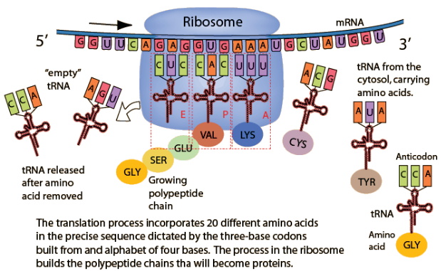
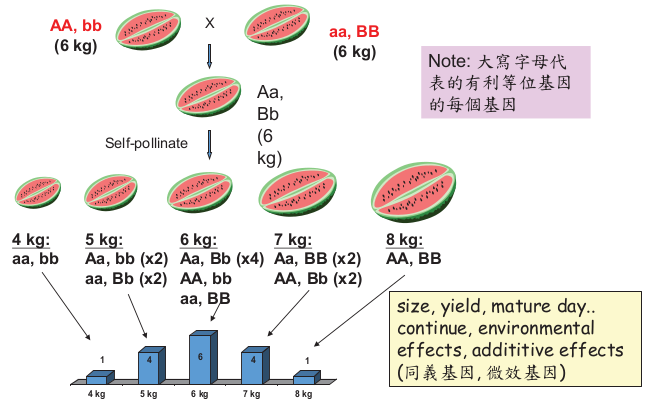
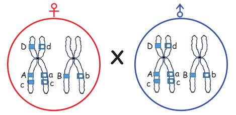

# 園藝作物育種

## DNA

> Genome(基因體):一個細胞內所含的全部遺物質 DNA
> 
> Chromosome(染色體): DNA纏繞組織蛋白(histone) 可被鹼性色素染色得名
> 
> Base pair (鹼基對)
> 
> > A - T
> > 
> > C - G
> > 
> > A: Adenine (腺嘌呤)
> > 
> > T: Thymine (胸嘧啶) / U: Uracil (尿嘧啶)
> > 
> > C: Cytosine (胞嘧啶)
> > 
> > G: Guanine (鳥嘌呤)

### Transcription: From DNA to RNA (轉錄)

### Translation: From RNA to protein (轉譯)

> In ribosome (核醣體)

### Heritable Infomation

> + Chromatin(染色質): a filamenous complex consisting primarily of DNA and proteins
> 
> + Chromosone(染色體): distinct granular(粒狀) bodies composed of chromatin that bear hereditary factors and are located in the plant cell's nucleus
> 
> + Genes: specific sequences of nucleotide-pairs on a DNA molecule that code for a given polypeptide.
> 
> + Genome(基因體): one complete set of chromosomes

---

## 突變(Mutation) ── 演化與育種的基礎

> 1. 染色體或基因突變   
>    
>    1. 缺失
>    
>    2. 重複影響與基因突變相似
>    
>    3. 逆位
>    
>    4. 轉座
> 
> 2. 整條染色體之變化，為非整數倍多倍體
> 
> 3. 全套染色體之變化
>    
>    1. 單倍體 (單元體)
>    
>    2. 多倍體 (多元體)
> 
> 4. 天然雜交之基因重組

### 天然突變、自發突變 (spontaneous mutation)

+ 受外界環境自然條件的影響或由作物體內的生理變化而發生的突變稱之。

+ 自發突變在特定基因座上由十萬分之一到百萬分之一，突變率因品種、基因座間而有不同，有害突變多於有益突變

+ 天然突變頻率過小，有利於育種的突變常常可遇不可求

+ 無性繁殖作物與果樹栽培上常利用芽條變異(sport)

+ 蔬菜：甘薯和馬鈴薯等，由自然體細胞突變而成之商業品種

+ 花卉中多種觀賞植物的嵌合花、條斑葉。鬱金香的現代品種白心(White Sim)、康乃馨

### 誘發突變 (induced mutation)

+ 誘發突變是由放射線及某些化學物質處理引發之突變，例如 EMS(甲基磺酸乙酯) 會導致 G 變 A

+ 應用於育種之優點
  
  1. 育成新品種所需時間較其他育種法為短
  
  2. 可產生自然界未發現過的新性狀
  
  3. 打破連鎖基因效應
  
  4. **高度異型接合之營養繁殖作物最適合誘變育種**

+ 應用於育種之缺點
  
  1. 需大量族群作選拔、費地費工
  
  2. 有利突變常伴隨染色體缺失及其它異常現象
  
  3. 誘變之反應因作物種類與品種而不同，自花授粉的二倍體豌豆誘變成功率高，營養繁殖作物誘變的機會也很高。如菊花、大麗菊
  
  4. 僅有**少數誘變能直接利用，通常不良性狀與優良突變同在**

### Genotype vs phenotype

+ The genotype is the genetic makeup of an organism. 基因型

+ A phenotype is the visible result of an interaction between the genotype and the environment. 外表型

$$
P = G + E
$$

> P: Phenotype
> 
> G: Genotype
> 
> E: Environment

### 孟德爾定律 Model's Low

1. law of dominance (顯性定律)：雜種的表現與雜種親本相同的性狀。

2. low of segregation (分離定律)：雜種產生配子時，相同性狀的基因，彼此分開到不同的配子

3. low of purity (純粹定律)：各對傳基因，在雜種細胞裡結合起來，但並不混合，各自保持純粹狀態

4. low of independent assortment (獨立分配定律)：不同對的遺傳基因，在雜交形行配子時各自獨立分配到不同配子，互不干擾。

## 多基因遺傳

#### 上位性(epistasis)

> 南瓜
> 
> W 顯性白色, w 隱性，Y 顯性黃色, y 隱性
> 
> W 對 Y 為上位
> 
> + W ? Y ? 白色
> 
> + W ? y y 白色
> 
> + w w Y ? 黃色

#### 互補基因 (complementary gene)

> 兩顯性基因互相作用才顯現某種性狀
> 
> 兩種白花香豌豆雜交
> 
> 9 A ? B ? : 3 A ? b b : 3 a a B ? : 1 a a b b
> 
> 9 紫花 : 7 白花 (僅有 A B 同時存在才是紫色)

## 數量遺傳 (Quantitative Inheritance)

## 連鎖 (Linkage)

同一染色體上之基因，傾向一起遺傳之連鎖關係，故位於同一染色體上之很多基因為連鎖群

## 園藝作物育種方法

### 自交

放任自然亦能繼續自交，每一單株後代皆成一純系，雜交後代採混合育種，地方品種常為分離純系之好材料

### 異交

族群中之各個體基因型皆不同，產量、生長勢及適應力皆靠**雜種優勢**來維持，選拔育種採混合選種，繼續選種皆有效，生產一代**雜交種**或**合成品種(cultivar)**

雜交育種是應用最廣的育種方法，利用人工的有性雜交導致親本遺傳基因的重組，經過若干世代的性狀分離和選擇獲得經濟價值高於親本的新品種，供生產上推廣和利用

### 無性繁殖作物

異質結合基因穩定，但遺傳行為複雜，性狀固定

### 雜種優勢的理論

1. 顯性學說(dominance theory): 異交作物含有許多隱性基因，異質結合時，消除隱性基因的作用

2. 超顯性學說(over-dominance theory): 基因異質結合 (Aa) 比同質結合 (AA, aa) 表現的性狀較佳

### 雜種優勢利用 (Use of Hybrid Vigor)

雜交優勢盛行推廣採用之原因有：

> 1. 雜種生育旺盛
> 
> 2. 產量高
> 
> 3. 抗倒伏力
> 
> 4. 成熟整齊
> 
> 5. 耐病性及抗逆性強

雜種優勢雖在自交作物與異交作物均可能發生，但必須能廉㑯大量生產雜種的種子才行。實際能利用雜種優勢之作物必須符合下列條件之一：

+ 雜交一次可得多數種子之作物

+ 雌雄異花及異株之作物

+ 具有自交不親和性或利用雄不稔性

### 多倍體育種之利用

1. 單倍體 (haploid 或 monopolid) ：單倍體不是多倍體，但廣義來說也算染色體組數目不同的一種。在育種上尋找單倍體植株可利用**秋水仙鹼**加倍染色體組得到同質二倍體，而形成立即自交系，省去數年自交時間。單倍體由花藥培養較易得到。

2. 三倍體 (Triploid)：此種三倍體雖有不稔性，但常具有特有的優點。比如花卉中的玫瑰、菊花、鬱金香、水仙。水果中的蘋果、香蕉及無仔西瓜
   
   > **同質多倍體特徵**
   > 
   > 1. 核、細胞及器官之擴大 (花朵大而美麗)
   > 
   > 2. 植物營養器官之發育增進
