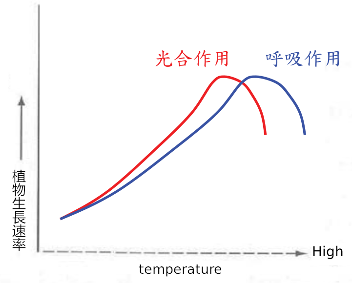

# 溫度與園藝植物

## Biology Effects of Temperatrue

+ Control physical & chemical processes

+ Solubility of substances(物質溶解速度)

+ Rate of reaction: effect on <u>respiration</u>(呼吸作用)

+ Q10: rate of change in reaction activity that results from 10°C of temp change

+ Stability of enzyme systems(酵素穩定)

+ Control physiological & biochemical processes
  
  Ex: absorption of minerals, photosythesis

+ Control growth & development

## Sugar and Starch conversions

$$
Sugar \Longleftrightarrow Starch+warter
$$

+ Potato: low temp(0°C - 5°C) → high sugar →caramel chip
  
  > 馬鈴薯在溫度低時，內含較多的糖份，導致在做油炸料裡時容易變黑

+ Asparagus, sweet corn and peas: harvested in early morning
  
  > 清晨溫度低，糖份較高，快速冷藏，否則醣會變成澱粉

+ Brussels sprout (抱子甘藍): planted in summer for a late fall harvest

+ 高溫讓花青素與茄紅素合成量少→著色不良

## Temperature Quotient: Q10

+ Van's Hoff Rule (範特霍夫氏定律)

+ 溫度每上升 10°C，化學反應速率增為 2 倍左右

$$
Q_{10}=\frac{R_2(rate\ at\ temperatrue\ T_1+10\degree C)}{R_1((rate\ at\ temperatrue\ T_1\degree C)} = 2
$$

## Temperature Coefficient

+ 溫度影響植物生化反應速率(呼吸作用)

+ 植物生長速率受溫度影響

+ 植物的適合生長溫度一般為 20°C - 30°C，但不見得是最佳生產溫度

## 生物適合生長溫度

+ 生物可依其溫度的忍受程度分為三類
  
  + 嗜低溫生物(psychrophiles): 適合在 0°C 至 20°C 低溫下生長，包括原始藻類、真菌、細菌
  
  + 嗜中溫生物(meso-philes): 大多數高等物屬於此類，適合生長之溫度在 10°C 至 30°C 之間
  
  + 嗜高溫生物(thermophiles): 可於 30°C 至 65°C 之間無礙地生長：藍綠藻更可於 85°C 下生長

+ 以上範圍之溫度，能提供生物進行水和作用及生長

+ 大多數種子含水量較低(例如5%)，可以忍受的溫度範圍更廣、期間更長

## 植物適合生長溫度

+ 大部份的植物可在 4.5°C - 36°C 之間正常生長

+ 生長溫度三基點：最低溫度、最適溫度、最高溫度

+ 生長最適溫度：**植物生長速率最快的溫度**

+ 協調最適溫度：(grow coordinate temperatrue) 生長最快並非生長最健壯，需要再略低於最適溫度之植物生長可最健壯
  
  > 比如莖的徒長長得很快，但並非最健壯

## 生物地理學(biogeography)

> 溫度影響生理與新陳代謝進而影響生物之分佈物種之地理區域反應植物的最適生長溫度
> 
> 高等植物生長相容之溫度範圍落於 0°C - 45°C
> 
> 溫度不僅限制生物之分佈，亦與經濟效益有顯著關係
> 
> 棉花(Gossypium): 南方作物，北方之夜溫低冷不利纖維細胞細胞壁增厚
> 
> 玉米無法於低溫下生長良好，也限制其在北方低溫地區的生產

## 溫度影響光合作用與呼吸作用

## Thermoperiod(熱週期)

+ 溫度對光合作用與呼吸作用的影響類似，但斜率不同

+ 光合作用速率達最高點之溫度低於呼吸作用達最高點之溫度

+ 白天**高溫下**，**光合作用效率下降**時，呼吸作用還在上升(消耗 > 製造)

+ 夜溫較低根莖類作物可儲藏較多碳水化合物

### DIF: Difference between day & night temp

EX:

| Day  | Night | DIF   |
|:----:|:-----:|:-----:|
| 25°C | 15°C  | +10°C |
| 23°C | 18°C  | +5°C  |

> The more positive the DIF the taller the plant (DIF 增加節間長度而非節的數目)
> 
> 日夜交替比恆溫更有利植物生長

## Growing Degree Days (Heats Units) 積算溫度，積熱

Degree Days = 每天平均溫度 - 作物門檻溫度

+ 每天平均溫度 = (每天最高溫+每天最低溫) / 2

+ 作物門檻溫度 = 「生長」最低溫度，而非「活著」最低溫度

積算溫度 = 累加從栽培到採收的溫度 = 作物需要的積熱

每個作物的積算溫度可以用來預估作物需要的生長日數，預估採收日期，或可從產期回推種植時間

## 土壤溫度

最適合土壤溫度：15°C - 30°C

發芽

> 冷季蔬菜發芽最高溫約 25°C
> 
> 暖季蔬菜發芽最低溫約 10°C

**根在高溫下不吸水**

> 夏季中午澆水，根不但不能吸收水份，水還會把植物的根給泡爛

## Vernalization (春化作用)

開花的過程

> 1. Flower induction (開始形成花原體)
> 
> 2. Flower initiation (花原體開始分化)
> 
> 3. Flower development (花器形成)
> 
> 4. Anthesis (綻放)

植物頂端**分生組織**在特定時間**感受特定長度的低溫才能使花原體形成**

也就是說，植物頂端的分生組織其實可以長成葉原體也可以長成花原體，只有受到春化作用才會長成花原體也才能開花

> 主要影響開花的因素
> 
> 1. 光 (長夜短夜)
> 
> 2. 溫度 (特定長度的低溫)
> 
> 3. 不受光與溫度之影響

**裸麥實驗**

> 春裸麥(長日照植物)(一年生)
> 
> + 長日照處理 7 片葉 →2 個月開花
> 
> + 短日照處理 22 片葉 → 4.5 個月開花
> 
> **冬裸麥(二年生) (低溫處理種子會有提早開花趨勢)**
> 
> + 正常溫度下發芽生長，不論何種日長皆 5 個月開花
> 
> + 1°C 處理數週，不論何種日長皆 7 片葉 2 個月開花

> **為什麼冬裸麥要在秋天種？**
> 
> 秋天播種，需要冬天的低溫誘導花芽分化，第二年春天開花結實，並在夏天的高溫時死亡
> 
> + 種子或幼苗經低溫處理後，可促使某些植物開花。如水仙若置於冷藏 2-3 週可很快萌芽、生長，並且開花
> 
> + 經吉貝素處理的種子或幼苗，不需經過低溫也可以提前開花

> **逆春化**
> 
> + 洋蔥冷藏易發芽開花，置於 27°C  2-3週使洋蔥不開花而形成莖球
> 
> + 春化作用後的冬小麥幼苗置於 30°C 的環境三至五天，可解除春化

## Dormancy (休眠)

> + Ecodormancy: 外在環境引起的休眠，如溫度、短日、逆境
> 
> + Endormancy: 內在因此引起的休眠，如遺傳、品種
> 
> + Paradoramancy: 相對位置引起的休眠，如頂芽優勢(頂芽會分泌激素不讓側芽長)
> 
> ### 溫度與休眠
> 
> + 薔薇科落葉果樹種類包括：梨、蘋果、李、桃、溫帶櫻桃、杏、梅落葉果樹自入秋氣溫降低後，**ABA增加**並累積到一定濃度時，果樹開始**進入休眠**。**ABA含量愈高植物落葉情況愈嚴重**，到達一定程度後植物就會停滯所有生理狀況，完全進入休眠狀態。(ABA: Abscisic acid 離層酸)
> 
> + 低溫 (5°C ± 4°C) 可分解 ABA ，當低溫累積一定時間後，ABA 濃度下降，激勃素(GA)與細胞分裂素(Cytokinins)的濃度高於ABA，即打破果樹的休眠，開始萌芽生長與開花
> 
> + 低溫需求(Chilling requirement)：打破休眠所需低溫累積時間，每種果樹有不同的低溫需求

## 溫度與種子休眠

剛脫落之種子具有休眠胚**需要經過一段低溫處理，再於適當溫度下才能發芽**，確保晚夏或秋季脫落之種子直到春季才發芽

## Temperature Stress

### 寒害與凍害

+ 寒害 (Chilling injury)
  
  > 亦稱為冷害，指對低溫敏感的作物，在接觸到冰點以上但低於 15°C 的低溫環境時，細胞受到傷害或死亡

+ 凍害 (Freezing injury)
  
  > 水的冰點是 0°C，但大多數園產品的冰點在 -0.1°C \~ -3°C。決定產品冰點重要因素為可溶性固型高，ex: 海棗(完熟後含糖量高達 60% 以上，冰點為 -15.7°C)
  > 
  > **超冷 (supercooling)**
  > 
  > 園產品之溫度低於冰點而仍未解凍。超冷時對園產品無害，但一經震動則迅速結凍並放出結凍熱 (latent heat of fusion)

+ 耐凍 (Freeze tolerance)

+ 避凍 (Freeze avoidance) 沙漠雨季期快速發芽生長完成生活史

### 高溫與熱害

+ 熱害
  
  > 酵素作用：30°C→高溫受阻。35°C→更多酵素活性受阻。40°C→酵素失去作用
  > 
  > + 青香蕉：35°C - 40°C 時對乙烯非常敏感，少量乙烯即可引發完熟，但若繼續在高溫下完熟，青色果皮無法轉黃，果皮易產生斑點並因失水過多而皺縮，果肉變軟而透明似水煮熟狀
  > 
  > + 酪梨：只能在 16°C - 21°C 完熟才能獲得良好品質。27°C完熟不均匀，30°C，抑制軟化，並使果肉變色
  > 
  > + 番茄：高溫完熟，不正常轉色，果肉呈水潰狀透明，類似曾經燙熟過
  > 
  > + 洋梨：若在 30°C - 35°C 完熟，會呈燙熟狀，質地風味俱差
  > 
  > + 芒果：耐高溫，38°C 仍能正常完熟

+ 耐熱 (Heat tolerance)
  
  + 植物：高溫還可以存活的植物
  
  + 園藝：高溫還可以生產好品質的品種→耐熱品種

+ 熱避免 (Heat avoidance)

## 
